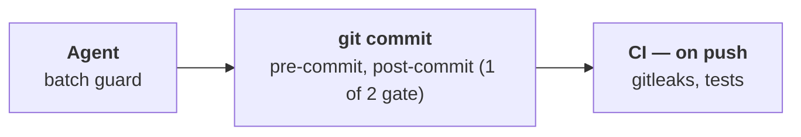

# Dev Setup

How my machine and my Claude Code agents are set up. Lives at `~/ws/dev-setup`.

## Machine

- [Maccy](https://maccy.app/) — clipboard manager
- [Rectangle](https://rectangleapp.com/) — window management
- Shell config is in `zsh/`. Install: `cp ~/ws/dev-setup/zsh/.zshrc ~/.zshrc` (it sources the
  rest of `zsh/` in place, so edits there are live).

## Conventions

| Path | What it is | Where to edit |
| --- | --- | --- |
| `global-claude/CLAUDE.md`, `global-claude/settings.json` | Copies of my global `~/.claude` config | `~/.claude` — `global-claude/sync.sh` (a `Stop` hook) copies changes here and commits them |
| `global-claude/guards/` | The command guard engine | Here — `~/.claude/settings.json` runs it from this repo |
| `.claude/` | This repo's own project config (`plans/`, `guard-rules.json`), same as any project | Here |

A project's own `CLAUDE.md` holds only what's specific to it — ports, build command, tests.

## Enforcement

`global-claude/guards/command_guard.py` is a global `PreToolUse` hook that checks every Bash command
against the project's `.claude/guard-rules.json`:

- **Rules:** `deny` blocks a command with a reason; `rewrite` swaps it for `rewrite_to` (the
  README's documented command). See `tests/fixtures/docker-node-rules.json` for an example.
- **Static:** only real commands match — not text in strings, heredocs or comments.
- **No rules file:** blocks once and asks whether to add rules. A `{"_comment": "..."}` stub means
  "no rules" and never asks again.
- **Fails closed:** broken rules, or a crashing guard, block.

`global-claude/guards/batch_guard.py` is a global `PostToolUse` hook on `Edit|Write|NotebookEdit` that
makes "commit often" a check. It reads the `batch` key of the same rules file —
`{"check": "<the README's test command>", "commit_at": 3, "push_at": 5}` — and after every
change inside the project:

- **Check:** runs `check`. A failure goes back to the agent; nothing is asked or committed.
- **Commit:** below `commit_at` changes since the last commit, the agent asks "Commit?". At
  `commit_at`, the hook stages the whole tree and commits it as `wip: <every file>`.
- **Push:** at `push_at` unpushed commits, the agent asks "Push?". The hook never pushes.
- **No `batch` key:** does nothing. The count lives in `.git/batch-guard.json`, tied to `HEAD`.

## Secret leak gate

`.githooks/pre-commit` runs gitleaks (Docker, pinned) on every commit and blocks any that carries
a credential — enable with `git config core.hooksPath .githooks`.

Tests: `python3 -m unittest discover tests/`

## Pipeline

<!-- pipeline:start -->

Generated from the hooks and workflows. Full detail: [`docs/pipeline.md`](docs/pipeline.md).

Shape, in text

<!-- pipeline:end -->

## Backlog: Refactor Along the Way

Known and deliberately not done yet. Each one gets picked up the next time I'm in that file.

- **Auto-commit `.zshrc` on change.** Manual `cp` for now. `global-claude/sync.sh` only walks paths under
  `~/.claude`, so this needs its `PATHS` generalised to `src:dest` pairs. Deliberately second: an
  auto-committer pointed at `.zshrc` is what made the secret gate a prerequisite, and the gate
  should have some mileage on it before anything commits that file unattended.
- **Let one repo reuse another's guard rules** — an `extends` key in `guard-rules.json` resolved
  before `Rules.__init__`. Today every repo keeps its own copy, and copy-paste is fine until
  there are enough of them to drift.
- **Retire the `SessionStart` `cp` in `~/.claude/settings.json`.** It copies skills out of
  `interview-prep` and `CV` into `~/.claude/` on every session start — the direction this repo's
  mirroring deliberately reverses, and it's ungated.
- **`ASK_USER` is tested for wording, not for being answerable.** The tests pin length, jargon and
  a closing question; nothing catches a question that's short, clean and still confusing.
- **Package the pipeline diagram.** Make it a `pyproject.toml` package with a `pipeline-diagram`
  entry point that depends on PyYAML. It gets installed at a pinned version in each repo's CI,
  replacing the copied `scripts/pipeline_*.py`. Do it when a third repo copies the files, or the
  first time two copies drift. Until then, deploying means `cp`.
