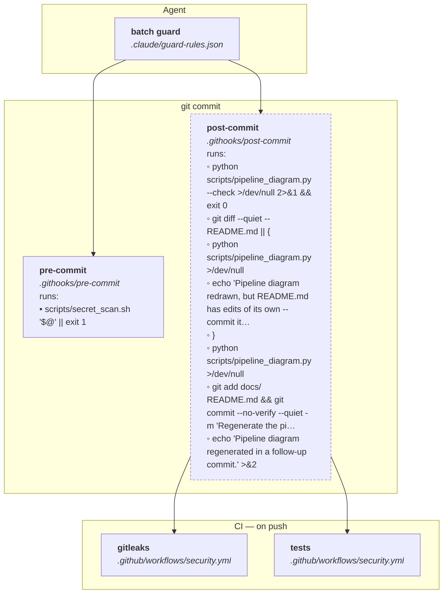

# Pipeline

<!-- Generated by scripts/pipeline_diagram.py from the git hooks, the workflow
     files and the command guard's rules. Do not edit by hand: .githooks/post-commit
     regenerates it in a follow-up commit whenever it goes stale. -->

Everything from a command an agent proposes to the last gate.

- **•** a step that stops the pipeline when it fails
- **◦** a step that only reports
- a dashed box never blocks anything

